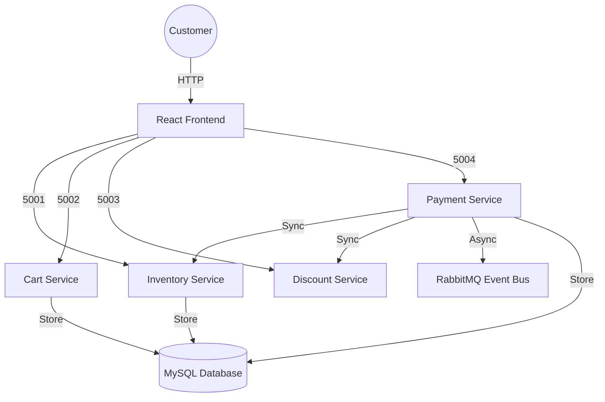

# 🛒 SmartShop — Smart E-Commerce Platform

> A full-stack microservices e-commerce platform featuring a modern React frontend and a robust Flask-based microservices backend. Built to simulate a real-world shopping experience with integrated inventory, cart, discount, and payment processing.


---

## 📌 Overview

SmartShop is a comprehensive e-commerce system that connects multiple independent microservices into a complete checkout pipeline—similar to how global platforms like Amazon or Flipkart handle operations behind the scenes.

**Key Architecture Highlights:**
- **Frontend**: A sleek, responsive React dashboard using FontAwesome for modern iconography.
- **Backend**: Five modular microservices (Inventory, Cart, Discount, Payment, RabbitMQ) for separation of concerns.
- **Data Integrity**: MySQL for persistent storage with atomic-style stock validation.

---

## ✨ New & Advanced Features

### 🛠️ Admin Dashboard 2.0
- **Order Tracking**: A dedicated "Orders" tab allowing admins to monitor every successful transaction in real-time.
- **Customer Insights**: View shipping details (name, email, phone, address) and order history for every purchase.
- **Inventory Management**: Full CRUD capabilities with real-time stock status badges and image preview support.

### 🛍️ User Experience (UX)
- **Smart Search**: Find products instantly with the real-time search filtering.
- **Advanced Sorting**: Browse by price (High to Low / Low to High) to find the best deals.
- **Premium Iconography**: Fully migrated from emojis to high-resolution FontAwesome icons for a professional look.

### 🛡️ Robust Backend Logic
- **Stock Reservation**: Payments are only processed if inventory is successfully reserved, preventing overselling.
- **Input Validation**: Server-side checks ensure that prices and quantities are always logical (non-negative).
- **Cart Sync**: Live cart counter updates across the application via API synchronization.

---

## 🧱 System Architecture



---

## 🚀 Getting Started

### Prerequisites
- [Docker Desktop](https://www.docker.com/products/docker-desktop/) installed and running
- [Node.js](https://nodejs.org/) (version 18 or higher)

### 1. Clone the Repository
```bash
git clone https://github.com/vishnucax/smart-ecom.git
cd smart-ecom
```

### 2. Infrastructure Setup (Docker)
Create the network and start the database and messaging services:
```bash
# Create internal network
docker network create ecommerce-net

# Start MySQL Database
docker run -d --name mysql-db --network ecommerce-net -e MYSQL_ROOT_PASSWORD=root123 -e MYSQL_DATABASE=ecommerce -p 3306:3306 mysql:8.0

# Start RabbitMQ
docker run -d --name rabbitmq --network ecommerce-net -p 5672:5672 -p 15672:15672 rabbitmq:3-management

# Wait ~15s for DB to initialize, then run schema:
docker exec -i mysql-db mysql -uroot -proot123 < backend/db-init/init.sql
```

### 3. Build & Run Backend Services
```bash
# Inventory Service
docker build -t inventory ./backend/inventory-service
docker run -d --name inventory --network ecommerce-net -p 5001:5001 inventory

# Cart Service
docker build -t cart ./backend/cart-service
docker run -d --name cart --network ecommerce-net -p 5002:5002 cart

# Discount Service
docker build -t discount ./backend/discount-service
docker run -d --name discount --network ecommerce-net -p 5003:5003 discount

# Payment Service
docker build -t payment ./backend/payment-service
docker run -d --name payment --network ecommerce-net -p 5004:5004 payment
```

### 4. Run Frontend
```bash
cd frontend
npm install
npm run dev
```
Navigate to `http://localhost:5173` to start shopping!

---

## 🔑 Admin Access
Access the dashboard at `http://localhost:5173/admin/login`
- **Email**: `admin@gmail.com`
- **Password**: `admin`

---

## 🎟️ Available Discount Codes
- `NEWYEAR` (10% off)
- `SAVE20` (20% off)
- `FLAT50` (50% off)

---

## 👨‍💻 Author

**Vishnu K**
- **Bio**: MCA Student | LEAD College, Palakkad
- **Email**: [Vishnukookkal@gmail.com](mailto:Vishnukookkal@gmail.com)
- **Portfolio**: [vishnucax.github.io](https://vishnucax.github.io)
- **LinkedIn**: [Vishnu K](https://linkedin.com/in/vishnucax)

---

## 📄 License

This project is licensed under the **MIT License**. 

> [!IMPORTANT]
> If you find this project helpful or use it in your own work, attribution to the original author (**Vishnu K**) is required. Please include a link back to this repository or my portfolio.

---

*Built with ❤️ for the Cloud Computing Subject Assignment.*
