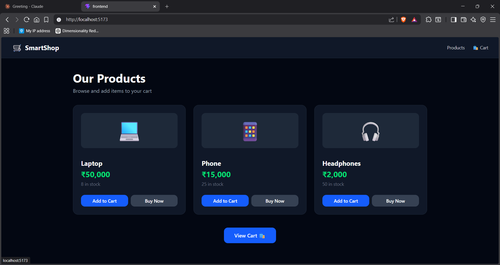
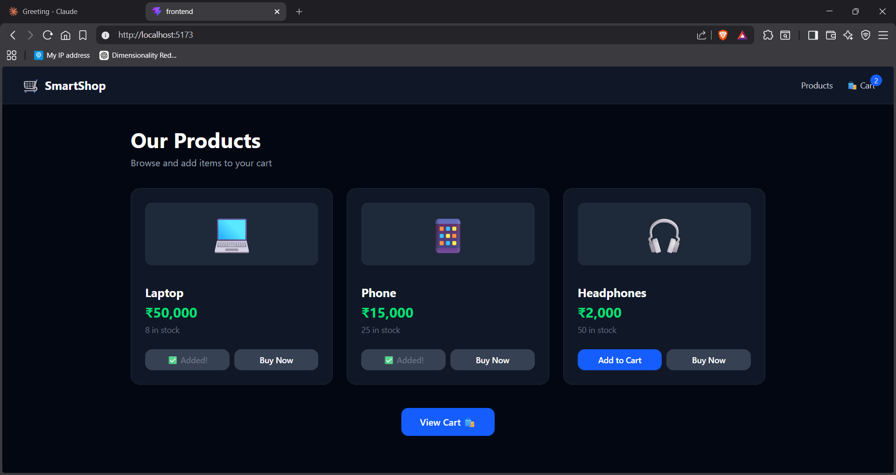
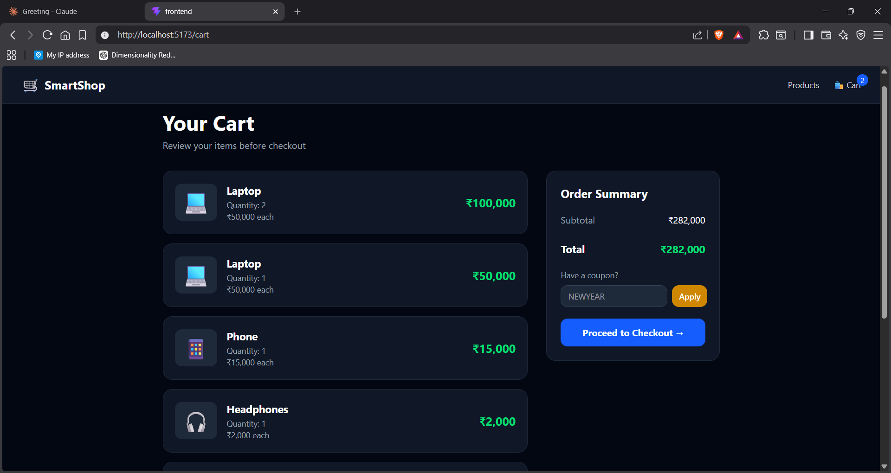
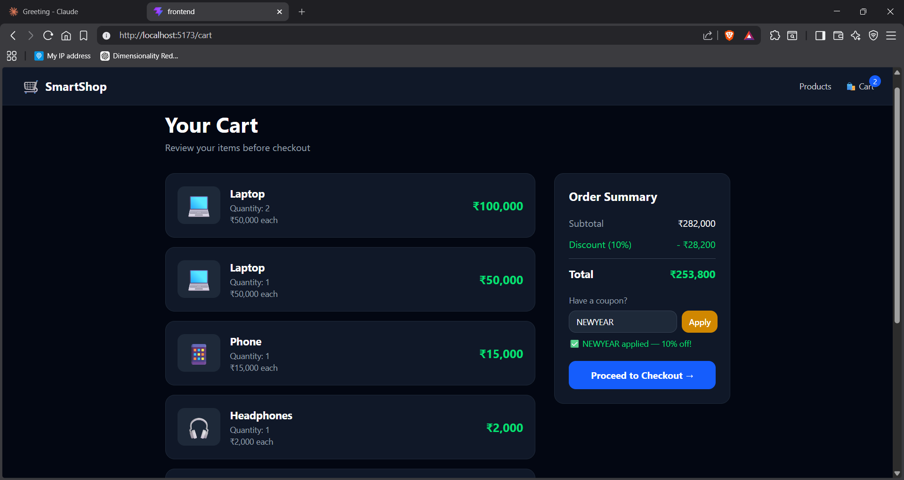
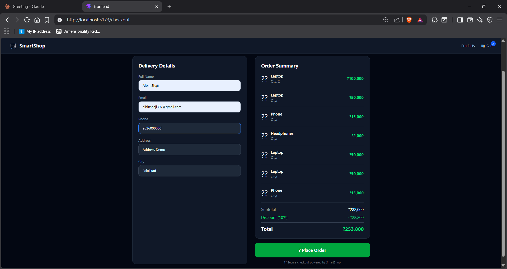
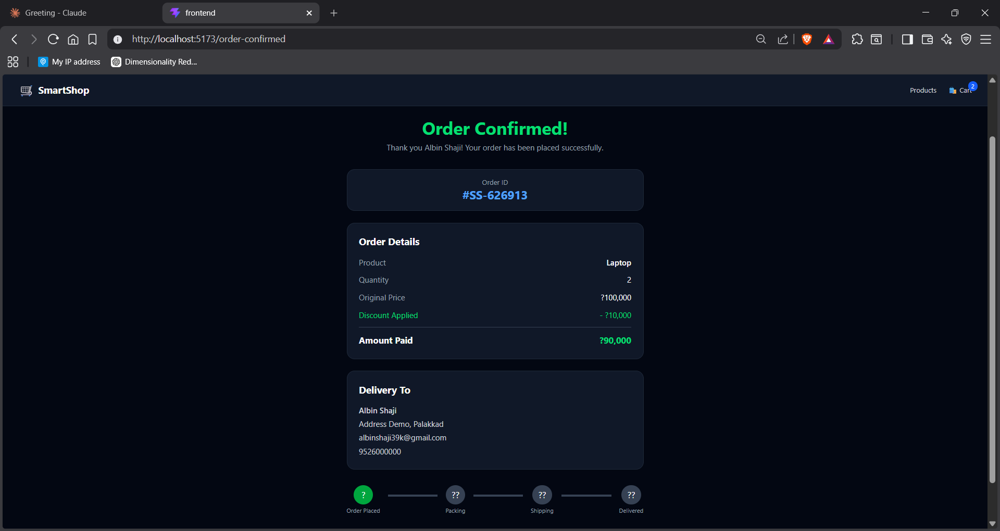

# 🛒 SmartShop — E-Commerce Frontend

> A React-based frontend for the Smart E-Commerce Checkout Workflow, providing a complete shopping experience from product browsing to order confirmation.


---

## 📌 Overview

SmartShop is the frontend interface for the Smart E-Commerce Checkout Workflow. It connects to a microservices backend (Flask + MySQL + RabbitMQ) and provides a seamless shopping experience — browse products, add to cart, apply discount codes, fill delivery details, and confirm your order.

Built as part of the **Cloud Computing** subject assignment for **MCA**.

**Backend Repository:** https://github.com/albin-shaji/smart-ecommerce-checkout

---

## 🔄 User Workflow
```
Browse Products → Add to Cart → Apply Discount → Checkout → Order Confirmed
```

---

## 📸 Screenshots

### 1. Products Page — Browse all available products


### 2. Add to Cart — Items added with live cart counter


### 3. Cart Page — Review items and apply discount


### 4. Discount Applied — NEWYEAR coupon applied (10% off)


### 5. Checkout Page — Fill delivery details and confirm order


### 6. Order Confirmed — Order placed with full details


---

## 🧱 Pages

| Page | Route | Description |
|------|-------|-------------|
| Products | `/` | Browse all products with Add to Cart and Buy Now |
| Cart | `/cart` | View cart items, apply discount coupon, proceed to checkout |
| Checkout | `/checkout` | Fill delivery details and place order |
| Order Confirmed | `/order-confirmed` | Order success page with order ID and delivery info |

---

## ⚙️ Tech Stack

| Technology | Purpose |
|------------|---------|
| React 18 | UI framework |
| Vite 8 | Build tool and dev server |
| Tailwind CSS 4 | Styling |
| React Router DOM | Page navigation |
| Axios | API calls to backend microservices |

---

## 🌐 Backend API Connections

| Service | URL | Used For |
|---------|-----|---------|
| Inventory Service | http://localhost:5001 | Fetch products and update stock |
| Cart Service | http://localhost:5002 | Add items and view cart |
| Discount Service | http://localhost:5003 | Apply coupon codes |
| Payment Service | http://localhost:5004 | Process payment and place order |

---

## 📁 Project Structure
```
frontend/
├── 📂 src/
│   ├── 📂 components/
│   │   └── Navbar.jsx          ← Navigation bar with cart counter
│   ├── 📂 pages/
│   │   ├── Products.jsx        ← Product listing page
│   │   ├── Cart.jsx            ← Cart with discount code
│   │   ├── Checkout.jsx        ← Delivery form + order summary
│   │   └── OrderConfirmed.jsx  ← Order success page
│   ├── App.jsx                 ← Routes and layout
│   ├── main.jsx                ← Entry point
│   └── index.css               ← Tailwind import
├── 📂 screenshots/             ← Demo screenshots
├── index.html
├── vite.config.js
└── package.json
```

---

## 🚀 Getting Started

### Prerequisites
- Node.js 18+
- Backend microservices running (see backend repo)

### 1. Clone the Repository
```
git clone https://github.com/albin-shaji/smartshop-frontend.git
cd smartshop-frontend
```

### 2. Install Dependencies
```
npm install
```

### 3. Start the Backend First
Make sure all backend containers are running:
```
docker start mysql-db rabbitmq inventory cart discount payment
```

### 4. Start the Frontend
```
npm run dev
```

### 5. Open in Browser
```
http://localhost:5173
```

---

## 🎟️ Available Discount Codes

| Code | Discount |
|------|----------|
| NEWYEAR | 10% off |
| SAVE20 | 20% off |
| FLAT50 | 50% off |

---

## 📄 License

This project is licensed under the **MIT License**

---
